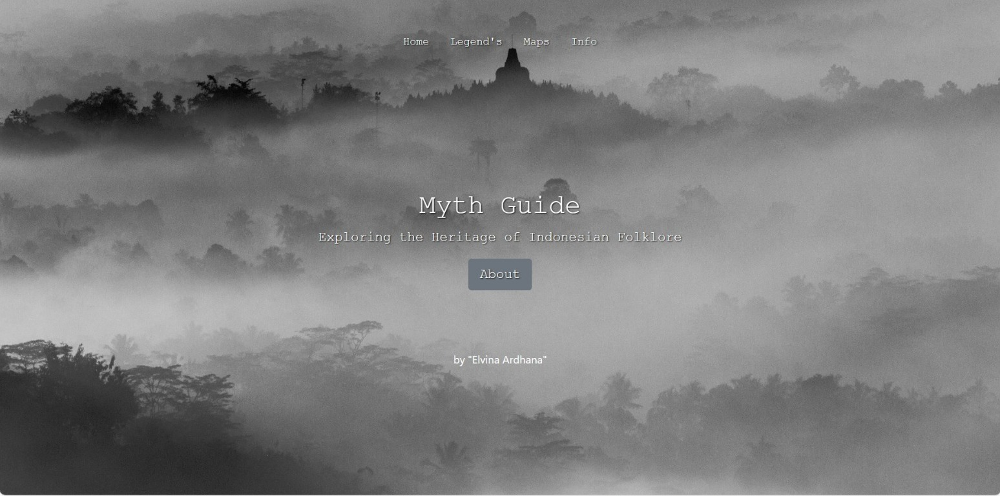

# pgweb-responsi
Myth Guide : Exploring the Heritage of Indonesian Folklore

Deskripsi produk:
"Myth Guide" merupakan sebuah website yang berisikan kumpulan legenda atau cerita rakyat asli Indonesia, 
yang di dalamnya dilengkapi dengan informasi wilayah dari latar cerita tersebut muncul.
Website ini dibuat dengan tujuan untuk melestarikan cerita rakyat Indonesia. Cerita rakyat adalah cerita-cerita tradisional yang telah diturunkan secara lisan dari generasi ke generasi, mencerminkan nilai-nilai budaya, kepercayaan, dan warisan sejarah suatu masyarakat.

Komponen pembangun produk:
Database phpMyAdmin | HTML |CSS |PHP

Sumber data:
1. Kumpulan cerita rakyat Indonesia
2. Data koordinat titik masing-masing wilayah
   
Tangkapan layar komponen penting produk:
1. Landing page:
   
   

